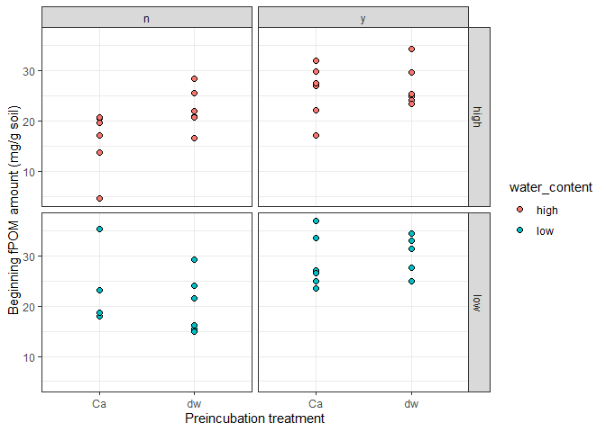
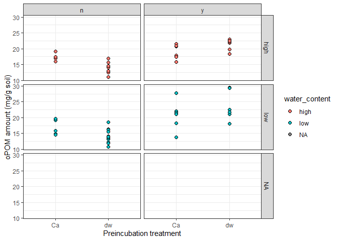
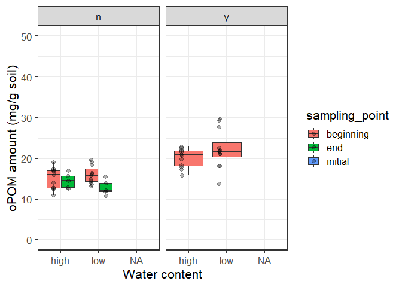

2020-11-29

  - [POM fraction amounts](#pom-fraction-amounts)
      - [fPOM amounts](#fpom-amounts)
      - [oPOM amounts](#opom-amounts)
      - [Total POM amounts](#total-pom-amounts)

``` r
# Packages
library(tidyverse)
library(here)
# Parameters
  file_data <- here("data/fractions_combined.rds")

#===============================================================================

# read in data
  df <- read_rds(file_data) 
```

## POM fraction amounts

### fPOM amounts

    ## Warning: Removed 2 rows containing missing values (geom_point).

<!-- -->

    ## Warning: Removed 2 rows containing non-finite values (stat_boxplot).
    
    ## Warning: Removed 2 rows containing missing values (geom_point).

<!-- -->

Ca treatment does not affect fPOM in any water content/litter treatnebt
combination fPOM amount seems to decrease from begininng to end of
incubation at high water content but remain similar at low water
content. his result fits delta13C-CO2 data that shows higher delta
values at higher water content.

### oPOM amounts

    ## Warning: Removed 43 rows containing missing values (geom_point).

<!-- -->

    ## Warning: Removed 43 rows containing non-finite values (stat_boxplot).
    
    ## Warning: Removed 43 rows containing missing values (geom_point).

<!-- -->

### Total POM amounts

    ## Warning: Removed 44 rows containing missing values (geom_point).

<!-- -->

    ## Warning: Removed 56 rows containing non-finite values (stat_boxplot).

    ## Warning: Removed 56 rows containing missing values (geom_point).

<!-- -->
