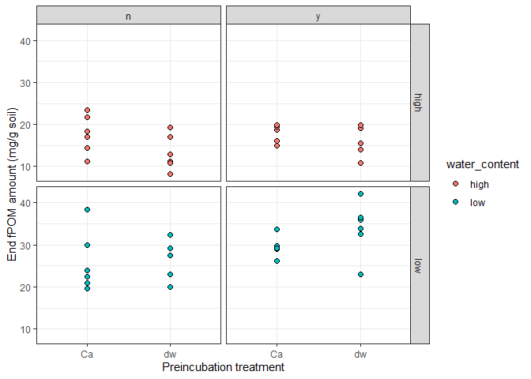
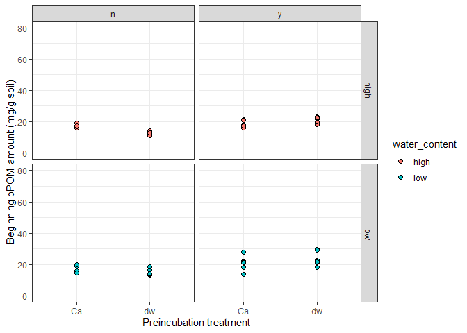
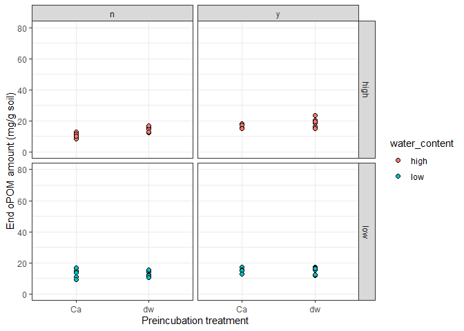

null
================
null
2021-05-19

-   [POM fraction amounts](#pom-fraction-amounts)
    -   [fPOM amounts](#fpom-amounts)
    -   [oPOM amounts](#opom-amounts)
    -   [Total POM amounts](#total-pom-amounts)

## POM fraction amounts

### fPOM amounts

    ## Warning: Removed 1 rows containing missing values (geom_point).

<!-- --><!-- -->

    ## Warning: Removed 1 rows containing missing values (geom_point).

<!-- -->

    ## Warning: Removed 1 rows containing non-finite values (stat_boxplot).

    ## Warning: Removed 1 rows containing missing values (geom_point).

<!-- --><!-- -->

    ##                              Df Sum Sq Mean Sq F value   Pr(>F)    
    ## sampling_point                1   56.8    56.8   1.641 0.203612    
    ## water_content                 1 1423.0  1423.0  41.079 7.03e-09 ***
    ## sampling_point:water_content  1  560.4   560.4  16.178 0.000122 ***
    ## Residuals                    88 3048.3    34.6                     
    ## ---
    ## Signif. codes:  0 '***' 0.001 '**' 0.01 '*' 0.05 '.' 0.1 ' ' 1
    ## 1 observation deleted due to missingness

<table>
<thead>
<tr>
<th style="text-align:left;">
term
</th>
<th style="text-align:right;">
df
</th>
<th style="text-align:right;">
sumsq
</th>
<th style="text-align:right;">
meansq
</th>
<th style="text-align:right;">
statistic
</th>
<th style="text-align:right;">
p.value
</th>
</tr>
</thead>
<tbody>
<tr>
<td style="text-align:left;">
sampling\_point
</td>
<td style="text-align:right;">
1
</td>
<td style="text-align:right;">
56.8294
</td>
<td style="text-align:right;">
56.8294
</td>
<td style="text-align:right;">
1.6406
</td>
<td style="text-align:right;">
0.2036
</td>
</tr>
<tr>
<td style="text-align:left;">
water\_content
</td>
<td style="text-align:right;">
1
</td>
<td style="text-align:right;">
1422.9797
</td>
<td style="text-align:right;">
1422.9797
</td>
<td style="text-align:right;">
41.0791
</td>
<td style="text-align:right;">
0.0000
</td>
</tr>
<tr>
<td style="text-align:left;">
sampling\_point:water\_content
</td>
<td style="text-align:right;">
1
</td>
<td style="text-align:right;">
560.4098
</td>
<td style="text-align:right;">
560.4098
</td>
<td style="text-align:right;">
16.1781
</td>
<td style="text-align:right;">
0.0001
</td>
</tr>
<tr>
<td style="text-align:left;">
Residuals
</td>
<td style="text-align:right;">
88
</td>
<td style="text-align:right;">
3048.3204
</td>
<td style="text-align:right;">
34.6400
</td>
<td style="text-align:right;">
NA
</td>
<td style="text-align:right;">
NA
</td>
</tr>
</tbody>
</table>

    ##                      Df Sum Sq Mean Sq F value   Pr(>F)    
    ## water_content         1   98.3    98.3   3.278   0.0774 .  
    ## litter                1  616.7   616.7  20.565 4.75e-05 ***
    ## water_content:litter  1    0.1     0.1   0.003   0.9544    
    ## Residuals            42 1259.4    30.0                     
    ## ---
    ## Signif. codes:  0 '***' 0.001 '**' 0.01 '*' 0.05 '.' 0.1 ' ' 1
    ## 1 observation deleted due to missingness

    ##                      Df Sum Sq Mean Sq F value  Pr(>F)    
    ## water_content         1 1885.1  1885.1  81.169 2.3e-11 ***
    ## litter                1  151.5   151.5   6.521  0.0144 *  
    ## water_content:litter  1   45.3    45.3   1.950  0.1700    
    ## Residuals            42  975.4    23.2                    
    ## ---
    ## Signif. codes:  0 '***' 0.001 '**' 0.01 '*' 0.05 '.' 0.1 ' ' 1

    ##   Tukey multiple comparisons of means
    ##     95% family-wise confidence level
    ## 
    ## Fit: aov(formula = fPOM_dry_mg_g ~ sampling_point * water_content, data = filter(df, sampling_point != "initial" & litter != "No Litter"))
    ## 
    ## $sampling_point
    ##                    diff       lwr      upr     p adj
    ## End-Beginning -1.571892 -4.010748 0.866965 0.2036125
    ## 
    ## $water_content
    ##              diff      lwr     upr p adj
    ## Low-High 7.865664 5.426231 10.3051     0
    ## 
    ## $`sampling_point:water_content`
    ##                                   diff        lwr       upr     p adj
    ## End:High-Beginning:High      -6.573998 -11.071508 -2.076489 0.0013581
    ## Beginning:Low-Beginning:High  2.926219  -1.623187  7.475625 0.3379977
    ## End:Low-Beginning:High        6.229207   1.731698 10.726717 0.0026594
    ## Beginning:Low-End:High        9.500218   4.903755 14.096680 0.0000031
    ## End:Low-End:High             12.803206   8.258102 17.348309 0.0000000
    ## End:Low-Beginning:Low         3.302988  -1.293474  7.899451 0.2432830

    ##   Tukey multiple comparisons of means
    ##     95% family-wise confidence level
    ## 
    ## Fit: aov(formula = fPOM_dry_mg_g ~ water_content * litter, data = df_end)
    ## 
    ## $water_content
    ##              diff      lwr      upr p adj
    ## Low-High 12.80321 9.935318 15.67109     0
    ## 
    ## $litter
    ##                            diff      lwr      upr     p adj
    ## Litter added-No litter 3.625621 0.757733 6.493509 0.0144636
    ## 
    ## $`water_content:litter`
    ##                                         diff        lwr       upr     p adj
    ## Low:No litter-High:No litter       10.659071   5.278032 16.040110 0.0000233
    ## High:Litter added-High:No litter    1.646287  -3.734752  7.027326 0.8454454
    ## Low:Litter added-High:No litter    16.277759  11.014999 21.540519 0.0000000
    ## High:Litter added-Low:No litter    -9.012784 -14.509557 -3.516011 0.0004278
    ## Low:Litter added-Low:No litter      5.618688   0.237649 10.999727 0.0377459
    ## Low:Litter added-High:Litter added 14.631472   9.250433 20.012511 0.0000000

    ##   Tukey multiple comparisons of means
    ##     95% family-wise confidence level
    ## 
    ## Fit: aov(formula = fPOM_dry_mg_g ~ water_content * litter, data = df_beg)
    ## 
    ## $water_content
    ##              diff        lwr     upr     p adj
    ## Low-High 2.926219 -0.3355921 6.18803 0.0773838
    ## 
    ## $litter
    ##                            diff      lwr      upr    p adj
    ## Litter added-No litter 7.322063 4.060252 10.58387 4.82e-05
    ## 
    ## $`water_content:litter`
    ##                                        diff       lwr       upr     p adj
    ## Low:No litter-High:No litter       2.495017 -3.776833  8.766867 0.7129228
    ## High:Litter added-High:No litter   7.248412  1.268438 13.228387 0.0119879
    ## Low:Litter added-High:No litter    9.929932  3.949957 15.909906 0.0003596
    ## High:Litter added-Low:No litter    4.753395 -1.518455 11.025245 0.1943781
    ## Low:Litter added-Low:No litter     7.434915  1.163064 13.706765 0.0144923
    ## Low:Litter added-High:Litter added 2.681520 -3.298455  8.661494 0.6305713

Ca treatment does not affect fPOM in any water content/litter treatnebt
combination fPOM decreases from begininng to end of incubation at high
water content This result fits delta13C-CO2 data that shows higher delta
values at higher water content. fPOM somewhat increases at low water
content - does low water content induce translocation of POM from
occluded to free?? Isotope ratio can help identify pathway.

### oPOM amounts

    ## Warning: Removed 1 rows containing missing values (geom_point).

<!-- --><!-- -->

    ## Warning: Removed 1 rows containing missing values (geom_point).

<!-- -->

    ## Warning: Removed 1 rows containing non-finite values (stat_boxplot).

    ## Warning: Removed 1 rows containing missing values (geom_point).

<!-- --><!-- -->

    ##                              Df Sum Sq Mean Sq F value   Pr(>F)    
    ## water_content                 1    2.5     2.5   0.185   0.6680    
    ## sampling_point                1  374.5   374.5  28.158 8.27e-07 ***
    ## water_content:sampling_point  1   56.2    56.2   4.226   0.0428 *  
    ## Residuals                    88 1170.4    13.3                     
    ## ---
    ## Signif. codes:  0 '***' 0.001 '**' 0.01 '*' 0.05 '.' 0.1 ' ' 1
    ## 1 observation deleted due to missingness

    ##                      Df Sum Sq Mean Sq F value   Pr(>F)    
    ## water_content         1   41.1    41.1   5.082   0.0295 *  
    ## litter                1  409.8   409.8  50.673 9.84e-09 ***
    ## water_content:litter  1   10.9    10.9   1.347   0.2524    
    ## Residuals            42  339.7     8.1                     
    ## ---
    ## Signif. codes:  0 '***' 0.001 '**' 0.01 '*' 0.05 '.' 0.1 ' ' 1
    ## 1 observation deleted due to missingness

    ##                      Df Sum Sq Mean Sq F value   Pr(>F)    
    ## water_content         1  17.57   17.57   3.040   0.0886 .  
    ## litter                1 136.47  136.47  23.607 1.68e-05 ***
    ## water_content:litter  1  30.72   30.72   5.314   0.0262 *  
    ## Residuals            42 242.79    5.78                     
    ## ---
    ## Signif. codes:  0 '***' 0.001 '**' 0.01 '*' 0.05 '.' 0.1 ' ' 1

    ##   Tukey multiple comparisons of means
    ##     95% family-wise confidence level
    ## 
    ## Fit: aov(formula = oPOM_dry_mg_g ~ water_content * sampling_point, data = filter(df, sampling_point != "initial"))
    ## 
    ## $water_content
    ##               diff       lwr      upr     p adj
    ## Low-High 0.3272239 -1.183976 1.838424 0.6680201
    ## 
    ## $sampling_point
    ##                    diff       lwr       upr p adj
    ## End-Beginning -4.035133 -5.546333 -2.523933 8e-07
    ## 
    ## $`water_content:sampling_point`
    ##                                   diff       lwr        upr     p adj
    ## Low:Beginning-High:Beginning  1.890532 -0.925771  4.7068351 0.3005418
    ## High:End-High:Beginning      -2.471825 -5.288128  0.3444783 0.1061894
    ## Low:End-High:Beginning       -3.707909 -6.524212 -0.8916060 0.0047373
    ## High:End-Low:Beginning       -4.362357 -7.178660 -1.5460538 0.0006130
    ## Low:End-Low:Beginning        -5.598441 -8.414744 -2.7821381 0.0000074
    ## Low:End-High:End             -1.236084 -4.052387  1.5802187 0.6600819

    ##   Tukey multiple comparisons of means
    ##     95% family-wise confidence level
    ## 
    ## Fit: aov(formula = oPOM_dry_mg_g ~ water_content * litter, data = df_end)
    ## 
    ## $water_content
    ##               diff       lwr       upr     p adj
    ## Low-High -1.236084 -2.666894 0.1947259 0.0885753
    ## 
    ## $litter
    ##                            diff      lwr      upr    p adj
    ## Litter added-No litter 3.441571 2.010761 4.872381 1.71e-05
    ## 
    ## $`water_content:litter`
    ##                                          diff        lwr        upr     p adj
    ## Low:No litter-High:No litter        0.2498774 -2.4347623  2.9345170 0.9944966
    ## High:Litter added-High:No litter    5.0839675  2.3993279  7.7686072 0.0000496
    ## Low:Litter added-High:No litter     2.0620877 -0.5635416  4.6877171 0.1695169
    ## High:Litter added-Low:No litter     4.8340901  2.0917097  7.5764706 0.0001522
    ## Low:Litter added-Low:No litter      1.8122103 -0.8724293  4.4968500 0.2850381
    ## Low:Litter added-High:Litter added -3.0218798 -5.7065194 -0.3372401 0.0219582

    ##   Tukey multiple comparisons of means
    ##     95% family-wise confidence level
    ## 
    ## Fit: aov(formula = oPOM_dry_mg_g ~ water_content * litter, data = df_beg)
    ## 
    ## $water_content
    ##              diff       lwr      upr     p adj
    ## Low-High 1.890532 0.1981251 3.582939 0.0294506
    ## 
    ## $litter
    ##                            diff      lwr      upr p adj
    ## Litter added-No litter 5.975404 4.281395 7.669413     0
    ## 
    ## $`water_content:litter`
    ##                                        diff       lwr       upr     p adj
    ## Low:No litter-High:No litter       0.874039 -2.369734  4.117812 0.8882667
    ## High:Litter added-High:No litter   5.001265  1.825789  8.176740 0.0007288
    ## Low:Litter added-High:No litter    7.823582  4.648106 10.999057 0.0000003
    ## High:Litter added-Low:No litter    4.127226  0.951750  7.302701 0.0063155
    ## Low:Litter added-Low:No litter     6.949543  3.774067 10.125018 0.0000038
    ## Low:Litter added-High:Litter added 2.822317 -0.283359  5.927994 0.0866704

oPOM decreases from beginning to end in all conditions, especially in
low water content when litter is added. Is this translocation to fPOM,
or just preferentia decomposition of oPOM vs fPOM in low water content.

### Total POM amounts

    ## Warning: Removed 2 rows containing missing values (geom_point).

<!-- --><!-- -->

    ## Warning: Removed 2 rows containing missing values (geom_point).

<!-- -->

    ## Warning: Removed 2 rows containing non-finite values (stat_boxplot).

    ## Warning: Removed 2 rows containing missing values (geom_point).

<!-- -->

    ##                              Df Sum Sq Mean Sq F value   Pr(>F)    
    ## sampling_point                1    708   707.6  11.822   0.0009 ***
    ## water_content                 1   1618  1618.5  27.040 1.31e-06 ***
    ## sampling_point:water_content  1    228   228.1   3.811   0.0541 .  
    ## Residuals                    87   5207    59.9                     
    ## ---
    ## Signif. codes:  0 '***' 0.001 '**' 0.01 '*' 0.05 '.' 0.1 ' ' 1
    ## 2 observations deleted due to missingness

    ##                      Df Sum Sq Mean Sq F value   Pr(>F)    
    ## water_content         1  307.9   307.9   8.972  0.00463 ** 
    ## litter                1 2104.2  2104.2  61.311 1.14e-09 ***
    ## water_content:litter  1    4.6     4.6   0.133  0.71698    
    ## Residuals            41 1407.1    34.3                     
    ## ---
    ## Signif. codes:  0 '***' 0.001 '**' 0.01 '*' 0.05 '.' 0.1 ' ' 1
    ## 2 observations deleted due to missingness

    ##                      Df Sum Sq Mean Sq F value   Pr(>F)    
    ## water_content         1 1538.7  1538.7  57.975 1.95e-09 ***
    ## litter                1  575.5   575.5  21.682 3.22e-05 ***
    ## water_content:litter  1    1.4     1.4   0.053    0.819    
    ## Residuals            42 1114.7    26.5                     
    ## ---
    ## Signif. codes:  0 '***' 0.001 '**' 0.01 '*' 0.05 '.' 0.1 ' ' 1

    ##   Tukey multiple comparisons of means
    ##     95% family-wise confidence level
    ## 
    ## Fit: aov(formula = total_POM ~ sampling_point * water_content, data = filter(df, sampling_point != "initial" & litter != "No Litter"))
    ## 
    ## $sampling_point
    ##                   diff       lwr       upr     p adj
    ## End-Beginning -5.57747 -8.801655 -2.353284 0.0009003
    ## 
    ## $water_content
    ##              diff      lwr      upr   p adj
    ## Low-High 8.434605 5.210419 11.65879 1.3e-06
    ## 
    ## $`sampling_point:water_content`
    ##                                   diff         lwr       upr     p adj
    ## End:High-Beginning:High      -8.802675 -14.7785944 -2.826755 0.0012313
    ## Beginning:Low-Beginning:High  5.233001  -0.8104459 11.276447 0.1135642
    ## End:Low-Beginning:High        2.764447  -3.2114730  8.740367 0.6211317
    ## Beginning:Low-End:High       14.035675   7.9922287 20.079122 0.0000002
    ## End:Low-End:High             11.567121   5.5912016 17.543041 0.0000131
    ## End:Low-Beginning:Low        -2.468554  -8.5120003  3.574893 0.7086643

    ##   Tukey multiple comparisons of means
    ##     95% family-wise confidence level
    ## 
    ## Fit: aov(formula = total_POM ~ water_content * litter, data = df_end)
    ## 
    ## $water_content
    ##              diff      lwr      upr p adj
    ## Low-High 11.56712 8.501317 14.63293     0
    ## 
    ## $litter
    ##                            diff      lwr    upr    p adj
    ## Litter added-No litter 7.067192 4.001387 10.133 3.27e-05
    ## 
    ## $`water_content:litter`
    ##                                         diff         lwr       upr     p adj
    ## Low:No litter-High:No litter       10.908949   5.1565577 16.661339 0.0000484
    ## High:Litter added-High:No litter    6.730255   0.9778638 12.482646 0.0161557
    ## Low:Litter added-High:No litter    18.339847  12.7138975 23.965796 0.0000000
    ## High:Litter added-Low:No litter    -4.178694 -10.0548062  1.697418 0.2426188
    ## Low:Litter added-Low:No litter      7.430898   1.6785073 13.183289 0.0066996
    ## Low:Litter added-High:Litter added 11.609592   5.8572012 17.361983 0.0000168

    ##   Tukey multiple comparisons of means
    ##     95% family-wise confidence level
    ## 
    ## Fit: aov(formula = total_POM ~ water_content * litter, data = df_beg)
    ## 
    ## $water_content
    ##              diff     lwr      upr     p adj
    ## Low-High 5.233001 1.70476 8.761241 0.0046344
    ## 
    ## $litter
    ##                            diff      lwr      upr p adj
    ## Litter added-No litter 13.70289 10.16766 17.23812     0
    ## 
    ## $`water_content:litter`
    ##                                         diff        lwr      upr     p adj
    ## Low:No litter-High:No litter        4.225168 -2.6287155 11.07905 0.3624866
    ## High:Litter added-High:No litter   13.087552  6.5396767 19.63543 0.0000208
    ## Low:Litter added-High:No litter    18.591389 12.0435136 25.13926 0.0000000
    ## High:Litter added-Low:No litter     8.862383  2.1458659 15.57890 0.0054846
    ## Low:Litter added-Low:No litter     14.366220  7.6497028 21.08274 0.0000062
    ## Low:Litter added-High:Litter added  5.503837 -0.9001113 11.90779 0.1143847

Total POM (fPOM+oPOM) decrease in amount from beginning to end at high
water content, but remain the same at low water content (although
changes in each pool). This fits the delta 13C values and indicates POM
is sensitive to decomposition at higher water contents. This does not
mean C loss, it could mean relative stabilization after microbial
processing.

    ## Warning: Removed 4 rows containing missing values (geom_point).

<!-- -->

    ## Warning: Removed 2 rows containing missing values (geom_point).

<!-- -->

    ## Warning: Removed 6 rows containing missing values (geom_point).

<!-- -->

    ## Warning: Removed 6 rows containing non-finite values (stat_boxplot).

    ## Warning: Removed 6 rows containing missing values (geom_point).

<!-- -->

    ## Warning: Removed 1 rows containing non-finite values (stat_boxplot).

    ## Warning: Removed 1 rows containing missing values (geom_point).

<!-- -->

    ##                              Df Sum Sq Mean Sq F value Pr(>F)
    ## water_content                 1      7     6.6   0.004  0.951
    ## sampling_point                1     79    79.0   0.045  0.832
    ## water_content:sampling_point  1    673   673.3   0.387  0.536
    ## Residuals                    88 153218  1741.1               
    ## 1 observation deleted due to missingness

    ##                      Df Sum Sq Mean Sq F value Pr(>F)
    ## water_content         1    407   406.7   0.416  0.523
    ## litter                1   1578  1577.9   1.613  0.211
    ## water_content:litter  1   2112  2112.2   2.159  0.149
    ## Residuals            42  41094   978.4               
    ## 1 observation deleted due to missingness

    ##                      Df Sum Sq Mean Sq F value Pr(>F)
    ## water_content         1    273   273.3   0.110  0.741
    ## litter                1   1591  1591.4   0.643  0.427
    ## water_content:litter  1   2845  2845.5   1.149  0.290
    ## Residuals            42 103998  2476.1

    ##   Tukey multiple comparisons of means
    ##     95% family-wise confidence level
    ## 
    ## Fit: aov(formula = SC_dry_mg_g ~ water_content * sampling_point, data = filter(df, sampling_point != "initial"))
    ## 
    ## $water_content
    ##               diff      lwr      upr     p adj
    ## Low-High 0.5359547 -16.7547 17.82661 0.9510214
    ## 
    ## $sampling_point
    ##                   diff       lwr      upr     p adj
    ## End-Beginning 1.853826 -15.43683 19.14448 0.8317666
    ## 
    ## $`water_content:sampling_point`
    ##                                   diff       lwr      upr     p adj
    ## Low:Beginning-High:Beginning  5.946525 -26.27670 38.16975 0.9626176
    ## High:End-High:Beginning       7.264397 -24.95883 39.48762 0.9347420
    ## Low:End-High:Beginning        2.389781 -29.83344 34.61300 0.9973847
    ## High:End-Low:Beginning        1.317871 -30.90535 33.54109 0.9995569
    ## Low:End-Low:Beginning        -3.556745 -35.77997 28.66648 0.9915292
    ## Low:End-High:End             -4.874616 -37.09784 27.34861 0.9787985

    ##   Tukey multiple comparisons of means
    ##     95% family-wise confidence level
    ## 
    ## Fit: aov(formula = SC_dry_mg_g ~ water_content * litter, data = df_end)
    ## 
    ## $water_content
    ##               diff       lwr    upr    p adj
    ## Low-High -4.874616 -34.48724 24.738 0.741389
    ## 
    ## $litter
    ##                            diff       lwr      upr    p adj
    ## Litter added-No litter 11.75249 -17.86013 41.36511 0.427683
    ## 
    ## $`water_content:litter`
    ##                                          diff       lwr      upr     p adj
    ## Low:No litter-High:No litter        10.358335 -45.20404 65.92071 0.9589227
    ## High:Litter added-High:No litter    27.519642 -28.04273 83.08202 0.5526235
    ## Low:Litter added-High:No litter      6.388183 -47.95289 60.72926 0.9890737
    ## High:Litter added-Low:No litter     17.161307 -39.59609 73.91871 0.8499357
    ## Low:Litter added-Low:No litter      -3.970152 -59.53253 51.59222 0.9974846
    ## Low:Litter added-High:Litter added -21.131458 -76.69383 34.43092 0.7402742

    ##   Tukey multiple comparisons of means
    ##     95% family-wise confidence level
    ## 
    ## Fit: aov(formula = SC_dry_mg_g ~ water_content * litter, data = df_beg)
    ## 
    ## $water_content
    ##              diff       lwr      upr     p adj
    ## Low-High 5.946525 -12.66807 24.56112 0.5226365
    ## 
    ## $litter
    ##                             diff       lwr      upr     p adj
    ## Litter added-No litter -11.72475 -30.35697 6.907467 0.2111025
    ## 
    ## $`water_content:litter`
    ##                                          diff       lwr       upr     p adj
    ## Low:No litter-High:No litter        20.101516 -15.57639 55.779422 0.4424105
    ## High:Litter added-High:No litter     1.840448 -33.08626 36.767156 0.9989844
    ## Low:Litter added-High:No litter     -5.188435 -40.11514 29.738273 0.9784619
    ## High:Litter added-Low:No litter    -18.261068 -53.18778 16.665640 0.5072766
    ## Low:Litter added-Low:No litter     -25.289951 -60.21666  9.636757 0.2284973
    ## Low:Litter added-High:Litter added  -7.028883 -41.18788 27.130112 0.9459215

<!-- -->
